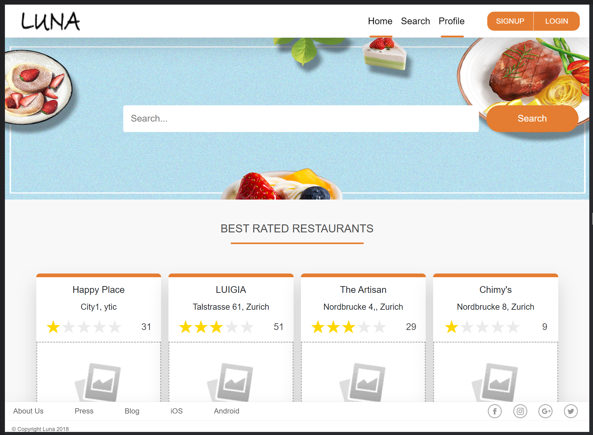

# Luna social platform

Luna is a web application built using:

 - React.JS 18
 - Django with REST Framework and Python 3.8

It emulates a social platform like TripAdvisor, where users can make reviews of local restaurants.

